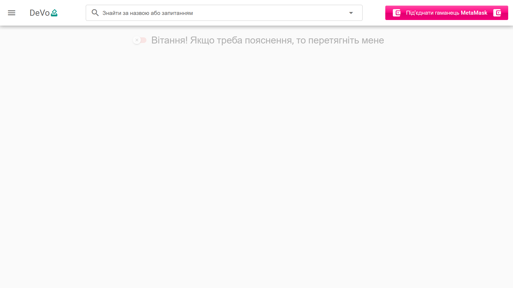
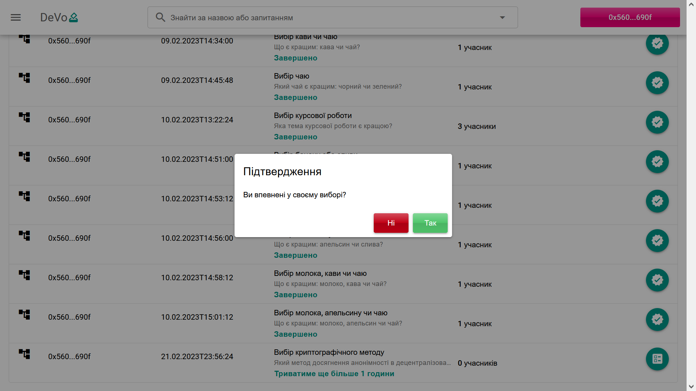
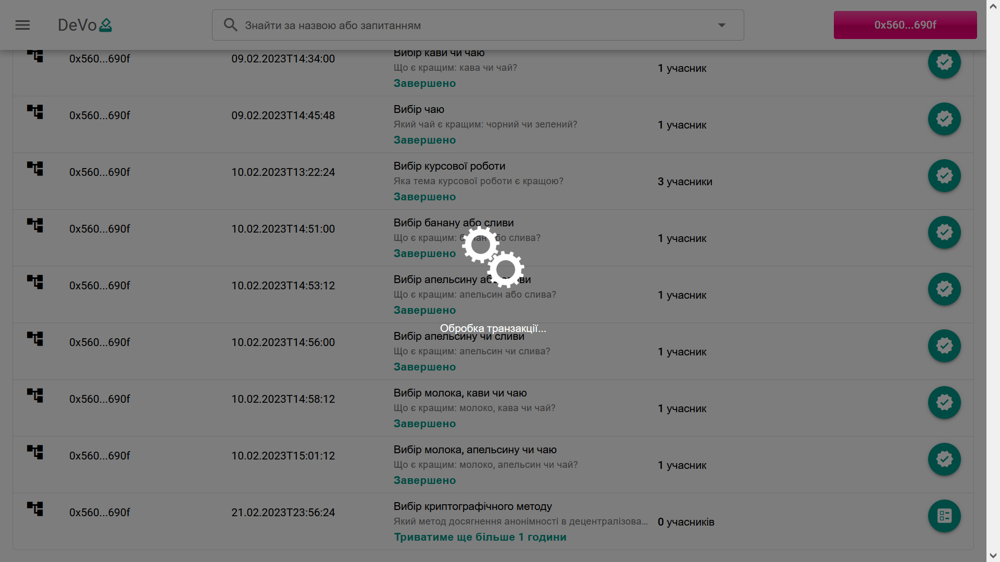

# DeVo

Decentralized Ethereum-based application. Permits to create polls and vote on-chain via MetaMask.

## 🛠 Tech Stack

**Contract:** Solidity.

**Blockchain:** Ethereum Goerli.

**Application:** Quasar framework.

## 🔗 Contract address

## 📌 Screenshots

## Authors

- [Alex Braun](https://github.com/Braun-Alex)
